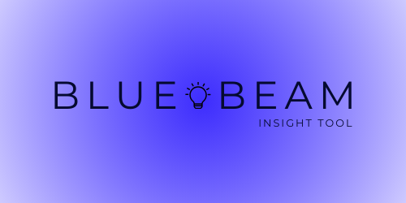

<!-- Improved compatibility of back to top link: See: https://github.com/othneildrew/Best-README-Template/pull/73 -->
<a id="readme-top"></a>
<!--
*** Thanks for checking out the Best-README-Template. If you have a suggestion
*** that would make this better, please fork the repo and create a pull request
*** or simply open an issue with the tag "enhancement".
*** Don't forget to give the project a star!
*** Thanks again! Now go create something AMAZING! :D
-->


<!-- PROJECT SHIELDS -->
<!--
*** I'm using markdown "reference style" links for readability.
*** Reference links are enclosed in brackets [ ] instead of parentheses ( ).
*** See the bottom of this document for the declaration of the reference variables
*** for contributors-url, forks-url, etc. This is an optional, concise syntax you may use.
*** https://www.markdownguide.org/basic-syntax/#reference-style-links
-->
[![MIT License][license-shield]][license-url]
[![LinkedIn][linkedin-shield]][linkedin-url]


<!-- PROJECT LOGO -->
<br />
<div align="center">
  <a href="https://github.com/BolvicBolvicovic/bluebeam">
    
  </a>

<h3 align="center">bluebeam</h3>

  <p align="center">
    Auditing websites in one click
    </br>
  </p>
</div>


<!-- TABLE OF CONTENTS -->
<details>
  <summary>Table of Contents</summary>
  <ol>
    <li>
      <a href="#about-the-project">About The Project</a>
      <ul>
        <li><a href="#built-with">Built With</a></li>
      </ul>
    </li>
    <li>
      <a href="#getting-started">Getting Started</a>
      <ul>
        <li><a href="#prerequisites">Prerequisites</a></li>
        <li><a href="#installation">Installation</a></li>
      </ul>
    </li>
    <li><a href="#usage">Usage</a></li>
    <li><a href="#roadmap">Roadmap</a></li>
    <li><a href="#contributing">Contributing</a></li>
    <li><a href="#license">License</a></li>
    <li><a href="#contact">Contact</a></li>
  </ol>
</details>


<!-- ABOUT THE PROJECT -->
## About The Project

bluebeam is a web extension for auditing websites in one click based on your criterias.


### Built With

* [![Go][Go.dev]][Go-url]
* [![Docker][Docker.com]][Docker-url]
* [![Mariadb][Mariadb.org]][Mariadb-url]
* [![Javascript][Javascript.com]][Javascript-url]


<!-- GETTING STARTED -->
## Getting Started

To get a local copy up and running follow these simple example steps.
It will lauch the server of the application with docker-compose.
If you do not use a Linux distro, I recommand that you read the documentation on how to lauch docker-compose on your OS.

```sh
git clone https://github.com/BolvicBolvicovic/bluebeam
cd bluebeam
sudo make
```

Then, in a new terminal at the root of the repository, run the following commands:

```sh
cd ext
web-ext run
```

### Prerequisites

You will need web-ext, go and docker-compose to lauch the project..
* go
```sh
wget https://go.dev/dl/go1.23.2.linux-amd64.tar.gz
rm -rf /usr/local/go && tar -C /usr/local -xzf go1.23.2.linux-amd64.tar.gz
export PATH=$PATH:/usr/local/go/bin
```
* web-ext, docker and docker-compose
```sh
sudo apt update && sudo apt upgrade
sudo apt install -y web-ext docker docker-compose
```

<p align="right">(<a href="#readme-top">back to top</a>)</p>


<!-- USAGE EXAMPLES -->
## Usage

### Register an account

At the moment, the only way to register an account is to do the request yourself with curl:

```bash
curl -X POST https://localhost/register_account -p '{"username" :"YourUserName", "password": "YourPassWord"}' -H {"Content-Type": "application/json"} --insecure
```

If you get a response that is positive, then you can login with this account.

### Login

Running web-ext will open firefox. Because the server is running on localhost and the certificate is self-signed (at the moment),
you need to go to Settings -> Tools -> Advanced -> View Certificates -> Servers -> Add Exception then Add https://localhost.
Finally, Go on the web-site you want to analyse and open the extension, then log in with your username and your password.

### Analyse

Once you are logged in, you can click on the analyse button and you will get a response.
At the moment, the response only says that the server is processing the data. 
In the future, depending on your settings, it will be able to send a report to help you improve your website based on your needs or just a json filled with the data you wanted to check.
See roadmap below.


<p align="right">(<a href="#readme-top">back to top</a>)</p>


<!-- ROADMAP -->
## Roadmap

- [ ] Response with a json that applies the chosen criterias on the website
- [ ] Response with a report in the form of a text, with insights on what to improve/modify
- [ ] Response with the posibility to create a report with graphs and text

See the [open issues](https://github.com/BolvicBolvicovic/bluebeam/issues) for a full list of proposed features (and known issues).

<p align="right">(<a href="#readme-top">back to top</a>)</p>


<!-- CONTRIBUTING -->
## Contributing

Contributions are what make the open source community such an amazing place to learn, inspire, and create. Any contributions you make are **greatly appreciated**.

If you have a suggestion that would make this better, please fork the repo and create a pull request. You can also simply open an issue with the tag "enhancement".
Don't forget to give the project a star! Thanks again!

1. Fork the Project
2. Create your Feature Branch (`git checkout -b feature/AmazingFeature`)
3. Commit your Changes (`git commit -m 'Add some AmazingFeature'`)
4. Push to the Branch (`git push origin feature/AmazingFeature`)
5. Open a Pull Request

<p align="right">(<a href="#readme-top">back to top</a>)</p>

### Top contributors:

<a href="https://github.com/BolvicBolvicovic/bluebeam/graphs/contributors">
  
</a>


<!-- LICENSE -->
## License

Distributed under the EUPL-1.2 License. See `LICENSE.txt` for more information.


<!-- CONTACT -->
## Contact

Project Link: [https://github.com/BolvicBolvicovic/bluebeam](https://github.com/BolvicBolvicovic/bluebeam)
Mail: victor.cornille@gmail.com

<p align="right">(<a href="#readme-top">back to top</a>)</p>


<!-- MARKDOWN LINKS & IMAGES -->
<!-- https://www.markdownguide.org/basic-syntax/#reference-style-links -->
[license-shield]: https://img.shields.io/badge/license-EUPL%201.2-blue
[license-url]: https://github.com/BolvicBolvicovic/bluebeam/blob/main/LICENSE.txt
[linkedin-shield]: https://img.shields.io/badge/-LinkedIn-black.svg?style=for-the-badge&logo=linkedin&colorB=555
[linkedin-url]: https://linkedin.com/in/victorcornille
[product-screenshot]: images/screenshot.png
[Go.dev]: https://img.shields.io/badge/Go-00ADD8?logo=Go&logoColor=white&style=for-the-badge[Next-url]
[Go-url]: https://go.dev/
[Docker.com]: https://img.shields.io/badge/docker-257bd6?style=for-the-badge&logo=docker&logoColor=white
[Docker-url]: https://www.docker.com/
[Mariadb.org]: https://img.shields.io/badge/MariaDB-003545?style=for-the-badge&logo=mariadb&logoColor=white
[Mariadb-url]: https://mariadb.org/
[Javascript.com]: https://shields.io/badge/JavaScript-F7DF1E?logo=JavaScript&logoColor=000&style=flat-square
[Javascript-url]: https://www.javascript.com/
